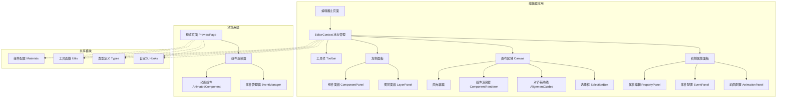

# 架构设计文档

## 概述

本设计文档基于需求文档，重构 H5 低代码编辑器和预览系统，采用现代化的 React 架构模式，实现高性能、可扩展的可视化编辑平台。

## 架构图



## 技术栈

### 前端框架
- **React 18**: 主要框架，支持并发特性
- **TypeScript**: 类型安全，提高代码质量
- **Next.js 14**: App Router 模式，支持 SSR/SSG

### 状态管理
- **React Context API**: 全局状态管理（编辑器状态）
- **Zustand**: 轻量级状态管理（已在项目中使用）
- **useState/useReducer**: 局部状态管理
- **自定义 Hooks**: 业务逻辑封装

### UI 组件库
- **Tailwind CSS**: 原子化 CSS 框架
- **Lucide React**: 图标库
- **shadcn/ui**: 基础 UI 组件

### 拖拽和交互
- **HTML5 Drag & Drop API**: 原生拖拽支持
- **Mouse/Touch Events**: 自定义拖拽交互
- **Intersection Observer**: 性能优化

### 动画系统
- **CSS Transitions**: 基础过渡动画
- **CSS Animations**: 关键帧动画
- **Web Animations API**: 复杂动画控制

## 核心模块设计

### 1. 状态管理架构

#### EditorContext 设计
```typescript
interface EditorContextType {
  // 核心数据
  components: ComponentData[]
  selectedId: string | null
  pageConfig: PageConfig
  isCanvasSelected: boolean
  
  // 操作方法
  setComponents: (components: ComponentData[]) => void
  setSelectedId: (id: string | null) => void
  setPageConfig: (config: Partial<PageConfig>) => void
  setIsCanvasSelected: (selected: boolean) => void
  clearSelection: () => void
  
  // 组件操作
  addComponent: (component: ComponentData) => void
  updateComponent: (id: string, updates: Partial<ComponentData>) => void
  deleteComponent: (id: string) => void
  duplicateComponent: (id: string) => void
}
```

#### 组件数据结构
```typescript
interface ComponentData {
  id: string
  type: string
  props: Record<string, any>
  style: Record<string, any>
  events?: EventConfig[]
  animations?: AnimationConfig
  children?: ComponentData[]
}
```

### 2. 组件渲染架构

#### 渲染器设计模式
- **ComponentRenderer**: 通用组件渲染器，支持编辑和预览两种模式
- **Material Registry**: 组件配置注册中心
- **Style System**: 样式应用和转换系统

#### 渲染流程
1. 根据组件类型查找配置
2. 应用样式和属性
3. 绑定事件处理器
4. 渲染子组件
5. 应用动画效果

### 3. 画布系统架构

#### 画布容器设计
- **固定尺寸**: 基于配置的画布尺寸
- **自动扩展**: 根据内容动态调整高度
- **滚动支持**: 内容溢出时支持滚动

#### 交互系统
- **拖拽系统**: 支持从组件库拖拽和画布内拖拽
- **选择系统**: 组件选择和画布选择
- **对齐系统**: 智能对齐辅助线
- **边界检测**: 拖拽边界限制

### 4. 事件管理架构

#### 事件配置结构
```typescript
interface EventConfig {
  id: string
  trigger: 'click' | 'dblclick' | 'mousedown' | 'mouseup'
  action: EventAction
  params?: Record<string, any>
}

interface EventAction {
  type: 'navigate' | 'alert' | 'custom'
  target?: string
  message?: string
  script?: string
}
```

#### 事件管理器
- **事件注册**: 运行时事件绑定
- **事件执行**: 安全的事件处理
- **参数传递**: 支持动态参数

### 5. 动画系统架构

#### 动画配置结构
```typescript
interface AnimationConfig {
  entrance?: {
    type: string
    duration: number
    delay: number
    easing: string
  }
  hover?: {
    type: string
    duration: number
    scale?: number
    rotate?: number
  }
  click?: {
    type: string
    duration: number
    scale?: number
  }
}
```

#### 动画组件设计
- **AnimatedComponent**: 动画包装组件
- **动画触发器**: 基于 Intersection Observer
- **动画状态管理**: 播放状态控制

## 页面布局设计

### 编辑器布局
```
┌─────────────────────────────────────────────────────────┐
│                    工具栏 (固定)                         │
├─────────────┬─────────────────────┬─────────────────────┤
│  左侧面板    │                     │    右侧属性面板      │
│  (固定宽度)  │     画布区域        │    (固定宽度)       │
│            │    (可滚动)         │                    │
│ ┌─────────┐ │                     │ ┌─────────────────┐ │
│ │组件面板  │ │                     │ │  属性编辑       │ │
│ └─────────┘ │                     │ └─────────────────┘ │
│ ┌─────────┐ │                     │ ┌─────────────────┐ │
│ │图层面板  │ │                     │ │  事件配置       │ │
│ └─────────┘ │                     │ └─────────────────┘ │
│            │                     │ ┌─────────────────┐ │
│            │                     │ │  动画配置       │ │
│            │                     │ └─────────────────┘ │
└─────────────┴─────────────────────┴─────────────────────┘
```

### 预览页面布局
- **全屏渲染**: 移除编辑器 UI，只显示页面内容
- **移动端适配**: 响应式设计，支持不同设备
- **性能优化**: 按需加载，减少资源消耗

## 数据流设计

### 编辑器数据流
1. **用户操作** → **事件处理** → **状态更新** → **界面重渲染**
2. **拖拽添加** → **组件创建** → **画布更新** → **图层同步**
3. **属性修改** → **数据验证** → **组件更新** → **实时预览**

### 预览数据流
1. **数据获取** → **组件解析** → **页面渲染** → **事件绑定**
2. **用户交互** → **事件触发** → **动作执行** → **状态反馈**

## 性能优化策略

### 渲染优化
- **React.memo**: 组件记忆化，避免不必要的重渲染
- **useMemo/useCallback**: 计算和函数记忆化
- **虚拟滚动**: 大量组件时的性能优化

### 拖拽优化
- **requestAnimationFrame**: 平滑的拖拽动画
- **事件节流**: 减少事件处理频率
- **批量更新**: 避免频繁的状态更新

### 预览优化
- **代码分割**: 按需加载组件
- **图片懒加载**: 优化图片资源加载
- **CSS 优化**: 减少样式计算开销

## 安全性设计

### 事件安全
- **沙箱执行**: 限制自定义脚本权限
- **输入验证**: 防止 XSS 攻击
- **CSP 策略**: 内容安全策略

### 数据安全
- **数据验证**: 组件数据结构验证
- **类型检查**: TypeScript 类型安全
- **错误边界**: React 错误捕获和恢复

## 测试策略

### 单元测试
- **组件测试**: React Testing Library
- **工具函数测试**: Jest
- **Hooks 测试**: @testing-library/react-hooks

### 集成测试
- **拖拽交互测试**: 模拟用户操作
- **状态管理测试**: Context 和 Hooks 集成
- **渲染测试**: 组件渲染正确性

### E2E 测试
- **用户流程测试**: Playwright 或 Cypress
- **跨浏览器测试**: 兼容性验证
- **性能测试**: 加载和响应时间

## 扩展性设计

### 组件扩展
- **插件系统**: 支持第三方组件
- **配置规范**: 统一的组件配置接口
- **动态加载**: 按需加载组件定义

### 功能扩展
- **Hook 系统**: 生命周期钩子
- **中间件模式**: 可插拔的功能模块
- **事件总线**: 模块间通信机制

这个架构设计确保了系统的可维护性、可扩展性和高性能，为后续的开发实现提供了清晰的技术指导。